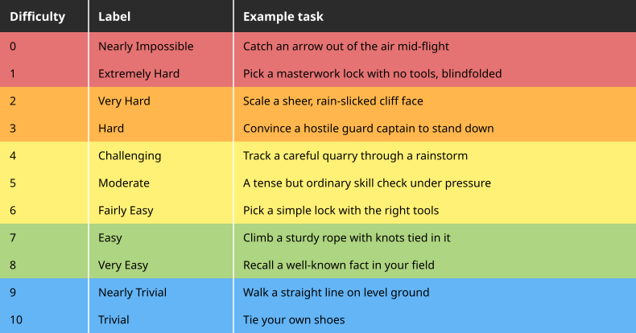
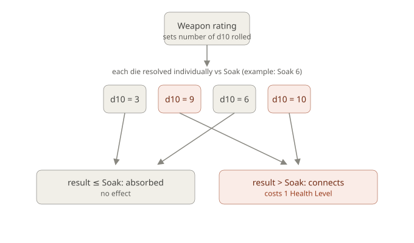

# Rules

## Core Mechanic

**Target number** = Attribute + Difficulty.

**Difficulty** is a number from **0-10**, set by the GM per roll - **0 is nearly impossible, 10 is trivially easy** (inverted from the usual "higher = harder" convention). See [Difficulty Chart](#difficulty-chart) below for the full 11-step ladder.

Roll **2d10** and sum them. Success if the result is **equal to or lower than** the target number.

Target number range: **1** (Attribute 1 + Difficulty 0) to **20** (Attribute 10 + Difficulty 10) - a target of 1 is below the lowest possible roll, i.e. an automatic failure, weighted toward the middle (11) rather than flat.

**Every Skill has a default Attribute/Element.** That default is what the roll uses unless the player challenges it. A player can challenge the default and pair the Skill with a different Attribute instead, provided they can argue the pairing to the GM's satisfaction - grounded in one of the character's own [Descriptors](#sub-stat-descriptors), a specific chosen flavor of a sub-stat ("I'm using Fire here instead of Firearms' default Air, because I'm being *Brutal* about it"), rather than an improvised justification from scratch. See [Skills](skills.md#skills-default-to-an-element) for the full rule.

### Difficulty Chart

An 11-step reference ladder for setting Difficulty, rather than picking a bare number cold, color-banded red (hardest) to blue (easiest):

| Difficulty | Label | Example task |
|---|---|---|
| 0 | Nearly Impossible | Catch an arrow out of the air mid-flight |
| 1 | Extremely Hard | Pick a masterwork lock with no tools, blindfolded |
| 2 | Very Hard | Scale a sheer, rain-slicked cliff face |
| 3 | Hard | Convince a hostile guard captain to stand down |
| 4 | Challenging | Track a careful quarry through a rainstorm |
| 5 | Moderate | A tense but ordinary skill check under pressure |
| 6 | Fairly Easy | Pick a simple lock with the right tools |
| 7 | Easy | Climb a sturdy rope with knots tied in it |
| 8 | Very Easy | Recall a well-known fact in your field |
| 9 | Nearly Trivial | Walk a straight line on level ground |
| 10 | Trivial | Tie your own shoes |

Per-Attribute example tasks (a Fire example vs. an Earth example at the same Difficulty) are deferred until the rest of the system is further along.

**Critical results, regardless of target number:**

- **A roll of 2** (both dice show 1) - critical success. In combat this has a specific effect, see [Critical Hits](#critical-hits).
- **A roll of 20** (both dice show 10) - catastrophic failure.

### Advantage / Disadvantage

**Advantage** rolls **3d10 and keeps the lowest two** (summed); **Disadvantage** rolls **3d10 and keeps the highest two** (summed) - roll-under, so lower is always better. Usable wherever a specific rule grants it - currently the [Expert/Master Skill Training Tiers](skills.md#training-tiers), a character's off-hand (below), but not restricted to those.

**Stacking**: Advantage and Disadvantage are each binary - having multiple sources of the same one doesn't compound it into something bigger. If a roll has sources of both at once, they cancel 1-for-1; whichever side has sources left over after canceling is what applies (still just plain Advantage or plain Disadvantage). Equal sources on both sides cancel out entirely and the roll is made normally.

**Off-hand**: performing a task that requires manual dexterity or precision (attacking, fine manipulation, etc.) with your off-hand imposes Disadvantage on the roll. [Ambidextrous](boons.md#trivial) removes this penalty.

### Untrained Rolls

If a character has no applicable Skill for the task, they still roll - but **the Attribute does not apply**. Target number is **Difficulty alone** (0-10), not Attribute + Difficulty. Having an applicable Skill is what lets the Attribute apply at all.

This is intentional: under the 2d10 curve, an untrained character faces poor odds at anything above Difficulty 5 or so, and Difficulty 0 (Nearly Impossible) is a flat impossibility untrained (target 0 is below 2d10's minimum roll of 2).

### Time Bands

A standard ladder of duration used wherever a rule needs to name "how long": **Round → Minute (≈10 rounds) → Scene → Day → Month → Year**. The **Round** is the base unit - any duration described elsewhere in the rules is stated in Rounds unless a longer band is explicitly named.

### Rests

Two recovery windows referenced throughout the rules - **Short Rest** and **Full Night's Rest** - anchored to real time. A **Short Rest** takes roughly **1 hour** of genuine downtime; only **one** Short Rest's worth of recovery can be gained between Full Night's Rests, no stacking a second hour spent resting for a second round of healing. A **Full Night's Rest** is a full, largely uninterrupted night's sleep.

## Ki

### Ki Infusion

Covers **all three attack types** - Physical, Social, and Mental - with the same shape and the same currency. The baseline attack die is raw and unboosted - `d10` vs. the defender's wall (Soak/Presence/Psyche as appropriate), so a wall of 10 fully negates it, guaranteed (0% connect). **Roll the attack's dice first, then spend.** With the dice on the table, the player picks which individual ones to boost and spends **1 Ki per die** - each boosted die adds the player's own matching sub-stat (**Ferocity** for Physical, **Presence** for Social, **Psyche** for Mental) to its result. A boosted die is compared as `d10 + [matching sub-stat]` vs. the wall, same threshold rule (result > wall connects).

Spending after the roll means no Ki is ever wasted - not on a die that already got through, and not on one too far under the wall for the sub-stat to save. It buys the same damage as committing blind would have, for roughly half the Ki.

This is a **direct Ki spend**, the same category as [spending Ki to preserve a Health Level or Sanity Level](#ki-spend-to-preserve-a-health-level-or-sanity-level) and [Bump Action Bracket](fate.md#ki-the-pool-formerly-risk-pool) - **not** a Fate Token spend, so it does **not** count against [Stamina's per-Scene spend cap](fate.md#staminas-job).

Full negation is still the honest baseline: an unboosted attack against a maxed wall can never get through, but a player willing to spend Ki can crack even a Soak/Presence/Psyche of 10 - a boosted die with a matching sub-stat of 10 is a guaranteed connect, while a rating of 2 only gives a 20% chance per boosted die.

### Ki Spend to Preserve a Health Level or Sanity Level

A player may spend **1 point from Ki** (the pool - distinct from [Fate Tokens](fate.md), the resource players earn/spend) to **cancel the loss of one Health Level or Sanity Level**, at a cost of 1 Ki per Level preserved. Multiple Ki can be spent to preserve multiple Levels, even across both tracks from the same attack. **Poise works differently and isn't covered by this rule** - Ki can't prevent a Poise loss; see [Poise](#poise) for its own Ki-refill rule instead.

## Attributes

### The Elements

Five attributes, each linked to a classical element. Each pairs a **domain** (narrative flavor) with a **mechanical role** (two sub-stats).

| Attribute | Domain | Mechanical Role |
|---|---|---|
| **Earth** | Physical power/endurance | Soak / Potence |
| **Air** | Agility/adaptability, mind/intellect | Initiative / Psyche |
| **Fire** | Drive/aggression | Ferocity / Presence |
| **Water** | Perception/empathy | Stamina / Health |
| **Moira** | Fate/destiny/the supernatural | Atropos / Klotho |

Attributes are scored **1-10** (1 = lowest, 10 = highest).

### Sub-Category Allocation

Every Attribute's Mechanical Role is **two sub-stats**. The Attribute's own score is **always the number used to roll** (see [Core Mechanic](#core-mechanic)) - it is never reduced or consumed by the split below.

Separately, that same score generates a **pool of points equal to the Attribute's rating**, which the player allocates across its two sub-stats - a player choice, not an even split. An Attribute of 10 both rolls as 10 *and* grants 10 points to divide, e.g. 7 Soak / 3 Potence, or 5/5, or any other division. What each allocated point actually *buys* in each sub-stat is defined case by case, sub-stat by sub-stat.

**This allocation is permanent.** Once a point is spent into a sub-stat, it's spent - there's no reallocating a pair's split later, same as Descriptors being fixed once chosen.

### Sub-Stat Descriptors

For every point a character allocates to a sub-stat, they gain one Descriptor - a short player-chosen word capturing one specific flavor of that sub-stat for this character. E.g. 3 points in Soak might yield *Hardy, Weathered, Unyielding* - three distinct ways the character shrugs off harm, not three copies of the same idea.

**Descriptors are core traits.** They're **free at character creation** (no separate cost beyond the point that earns them) and **fixed once chosen** - there is no way to buy an extra Descriptor beyond what a sub-stat's points earn, at creation or later. A character who wants a broader spread of Descriptors gets there by raising the sub-stat, not by purchasing the trait on its own.

Descriptors are one or two-word adjectives, not phrases - *Brutal*, *Brawny*, *Indefatigable*, *Headstrong*, not "Killer Instinct, Relentless, and Simmering Rage all at once." Tight, punchy, and easy to say out loud at the table.

**Every Skill defaults to an Attribute/Element** (see [Skills](skills.md#skills-default-to-an-element)). Descriptors are the concrete hook a player points to when challenging that default - grounding "I'm using Fire here because I'm being *Brutal*" in an established character fact instead of an improvised justification each time.

**Sample Descriptors**, 15 examples per sub-stat to jump-start character creation - these are just starting points, not a fixed list. A player is always free to write their own instead, as long as it's a short adjective capturing a real flavor of that sub-stat:

| Sub-Stat | Sample Descriptors |
|---|---|
| Soak | Hardy, Rugged, Stoic, Weathered, Unyielding, Sturdy, Grizzled, Armored, Callused, Thick-Skinned, Leathery, Battle-Worn, Steeled, Resistant, Flinty |
| Potence | Brawny, Herculean, Mighty, Strapping, Muscular, Titanic, Forceful, Robust, Hulking, Sinewy, Vigorous, Burly, Formidable, Stout, Iron-Armed |
| Initiative | Alert, Reflexive, Twitchy, Vigilant, Quickened, Sharp-Eyed, Instinctive, Keen, Fleet, Snappy, Watchful, Attentive, Sharp, Nimble-Minded, Anticipatory |
| Psyche | Steadfast, Composed, Disciplined, Unshaken, Focused, Resolute, Headstrong, Serene, Level-Headed, Calm, Iron-Willed, Grounded, Unflappable, Determined, Clear-Headed |
| Ferocity | Brutal, Savage, Relentless, Feral, Merciless, Ruthless, Vicious, Predatory, Fierce, Aggressive, Bloodthirsty, Wrathful, Untamed, Cutthroat, Rabid |
| Presence | Magnetic, Commanding, Charismatic, Radiant, Imposing, Captivating, Dominant, Alluring, Striking, Charming, Bold, Regal, Magnificent, Unforgettable, Larger-Than-Life |
| Stamina | Indefatigable, Tireless, Enduring, Hardened, Persistent, Unflagging, Dogged, Steady, Untiring, Unwavering, Gritty, Marathon-Bodied, Long-Winded, Driven, Unrelenting |
| Health | Hale, Vital, Resilient, Stalwart, Ironclad, Unbreakable, Durable, Tenacious, Hearty, Sound, Thriving, Hard-to-Kill, Long-Lived, Wholesome, Sturdy-Framed |
| Atropos | Fated, Untouchable, Uncanny, Ghostly, Warded, Veiled, Overlooked, Passed-Over, Unmarked, Inviolate, Unsevered, Thread-Bound, Unreachable, Spared, Unbroken |
| Klotho | Lucky, Charmed, Serendipitous, Auspicious, Star-Touched, Timely, Quickening, Renewing, Replenishing, Rekindling, Brimming, Deep-Welled, Spring-Fed, Ever-Spinning, Unspent |

### The Passive Wall Triad - Soak, Presence, Psyche

Every attack, regardless of type, resolves in the same two steps. **First, a to-hit roll**: the attacker's Attribute (Earth, Air, Fire, or Water - whichever fits the attack) against the target's [Defense](#defense-derived-stat) as Difficulty, no Skill involved - a straight Attribute-vs-Defense roll, the same formula whether the attack is a fist, a threat, or a mind reaching where it isn't welcome. **Only a success reaches step two.** Then the attack's dice are resolved against the relevant wall stat, per die:

- **Soak** - wall against **Physical** damage dice.
- **Presence** - wall against **Social** attack dice.
- **Psyche** - wall against **Mental** attack dice.

Presence (Fire) and Psyche (Air) both mirror **Soak exactly** - the identical per-die mechanic, just resisting a different attack type. All three sub-stats are **passive gives**, the same way Health is: a flat number a character simply has, doing its job automatically with no roll or spend required.

For all three: each attack die is resolved individually against the relevant wall stat. Die ≤ wall stat is fully absorbed; die > wall stat connects. A wall stat of 10 guarantees 0% connect chance per die - true, complete negation - unless the attacker spends **Ki** (1 per die) to add their own matching Attack sub-stat to that specific die, per [Ki Infusion](#ki-infusion). A connecting Physical die costs a Health Level, a connecting Social die costs a Poise, a connecting Mental die costs a Sanity.

### Choosing the Attacking Element

Which of Earth/Air/Fire/Water applies to a to-hit roll is set by **how the character is attempting the attack**, not by their weapon or a Skill - there are no weapon-specific attack skills. The same weapon can be used with any of the four elements depending on the approach described:

- **Earth - Force.** Overpowering the target through raw physical strength - *"I put my entire weight behind the blow and smash through his guard."*
- **Air - Precision.** Succeeding through speed, timing, or exploiting an opening - *"I wait for him to move his guard, then thrust through the opening."*
- **Fire - Intensity.** Overwhelming through aggression and ferocity - *"I charge him screaming and attack relentlessly, trying to force him back."*
- **Water - Adaptation.** Responding to the opponent and turning their action back on them - *"I let his attack pass, redirect his momentum, and strike when he overextends."*

All four examples above use the same sword - the weapon never determines the element. **Moira is never an attacking element**; Atropos only ever sets Defense.

The player describes the attempt **before** rolling, and the GM confirms which element fits - not chosen retroactively to fish for a better number. This choice only sets which Attribute feeds the to-hit roll; it's not a second roll, doesn't change the attack's category (Physical/Social/Mental), and doesn't change what damage the weapon deals.

### Earth

#### Physical Attacks - Weapon Damage & Per-Die Resolution

After the attacker's [to-hit roll](#the-passive-wall-triad---soak-presence-psyche) succeeds, the **weapon in use sets how many d10 are rolled** - see [weapons.md](weapons.md) for the base list. **Each die is resolved individually against the defender's Soak**, not summed together:

- **Die result > Soak** - that die connects, and costs the defender **one Health Level**.
- **Die result ≤ Soak** - that die is fully absorbed, no effect.

**Soak 10 guarantees 0% connect chance per die - true, complete negation.** A heavier weapon (more dice) doesn't overwhelm Soak mathematically - it just means **more independent chances to connect**, so a single attack can plausibly cost a defender **multiple** Health Levels at once if several dice connect (subject to the [crossing-zero throttle](#health-levels) once the defender is already at 0).

#### Armor & Called Shots

Worn or carried armor (see [Weapons & Equipment](weapons.md#armor)) has its own **Hardness** (a threshold on the same 0-10 scale as Soak) and its own **Health Levels**, both tracked separately from the wearer's. Every armor item covers one of two **Zones**: **Body** or **Head**.

While it still has Health Levels remaining, armor intercepts every die aimed at the Zone it covers, before the wearer's own Soak ever comes into play:

- **Die result ≤ Hardness** - deflected for free. No effect on the wearer, no cost to the armor.
- **Die result > Hardness** - still fully stopped, the wearer takes nothing - but the armor takes the hit instead. **An armor item never loses more than 1 Health Level per attack**, no matter how many of that attack's dice exceeded its Hardness.

**Once an armor item's Health Levels reach 0, it's broken.** It stops covering its Zone entirely - dice resolve straight against the wearer's own Soak, per the normal per-die rule above - until repaired (a downtime/GM-adjudicated task, not modeled further here).

**Ki Spend to Preserve** (see [above](#ki-spend-to-preserve-a-health-level-or-sanity-level)) only ever applies to the wearer's own Health or Sanity (or, for Poise, its own separate refill-after-0 rule) - it can't prevent or undo an armor Health Level loss.

- **Armor doesn't stack within a Zone.** If a character owns more than one item covering the same Zone, only one can be worn there at a time - their choice which.
- **A normal attack always resolves against Body-Zone armor.** Head-Zone armor does nothing against it.
- **A called shot** - an attack aimed at something specific rather than at the target generally: a hand, a knee, a strap, a weapon, a sensor. It's declared as part of a [Slow Action](#action-brackets), and spending Ki to [bump the bracket](#action-brackets) carries it along rather than cancelling it. What a successful called shot accomplishes is the GM's call, and depends on what was aimed at. Where it interacts with armor, a called shot to the **Head Zone** resolves against the defender's Head-Zone armor (or no armor at all, if they have none), and Body-Zone armor doesn't apply to it.

#### Potence

Potence (Earth's other sub-stat: raw physical power/strength - carrying capacity, immovability, mass, forcing/breaking things) splits into two jobs:

1. **Flat passive give (mundane use, no roll)** - Potence directly sets a **Carrying Capacity** and a **Break Threshold**.
   - **Carrying Capacity** (how much weight a character can lift/carry/drag under ordinary conditions): `Potence² × 10`, in kg.

     | Potence | Carrying Capacity |
     |---|---|
     | 1 | 10 kg (~22 lbs) |
     | 2 | 40 kg (~88 lbs) |
     | 3 | 90 kg (~198 lbs) |
     | 4 | 160 kg (~353 lbs) |
     | 5 | 250 kg (~551 lbs) |
     | 6 | 360 kg (~794 lbs) |
     | 7 | 490 kg (~1,080 lbs) |
     | 8 | 640 kg (~1,411 lbs) |
     | 9 | 810 kg (~1,786 lbs) |
     | 10 | 1,000 kg (~2,205 lbs) |
   - **Break Threshold** (the bar an object's resistance must sit under to be forced open/broken with no contest involved): no separate number, just a direct comparison. If a character's **Potence is equal to or greater than the target object's Soak**, it breaks or forces open automatically, no roll. If Potence is lower, it isn't a no-contest job anymore; that's what the contested dice pool below is for.
2. **Contested dice pool** - when forcing, breaking, or moving something that's actively resisting (a grapple, a door someone's holding shut, a struggling creature), **Potence itself sets how many d10 are rolled**. Each die is compared individually against the target's relevant resistance: a grappled/restrained creature's own **Soak**, or - for inanimate resisting objects - the object's own **Soak** (GM-set, same 0-10 scale and mechanic as a character's Soak, just held by the object instead). Each connecting die represents one increment of success, costing the object one of its **Health Levels** - same binary hit-box shape as a character's, just scaled to the object's durability instead of a body.

**Object Soak and Health Level reference chart**, low to high, for GM calibration:

| Object | Soak | Health Levels |
|---|---|---|
| Sheet of paper / cardboard | 0 | 1 |
| Glass pane / window | 1 | 1 |
| Rope / zip ties | 2 | 1 |
| Drywall interior wall | 2 | 2 |
| Wooden chair | 2 | 2 |
| Padlock (cheap) | 3 | 1 |
| Chain-link fence | 3 | 2 |
| Interior wooden door | 3 | 2 |
| Handcuffs (standard) | 4 | 1 |
| Car door | 5 | 3 |
| Exterior wooden door (reinforced) | 5 | 3 |
| Brick wall (residential) | 6 | 4 |
| Boulder / natural stone | 7 | 5 |
| Steel security door | 7 | 4 |
| Reinforced concrete wall | 8 | 5 |
| Bank vault door | 9 | 6 |
| Castle gate / fortress wall | 9 | 8 |
| High-security modern vault | 10 | 8 |

### Air

#### Sanity

Sanity mirrors Health Levels too, tracking a character's grip on their own mind against Mental attack.

- **`PC Sanity = 5 + Psyche`.** NPCs default to a flat 5. Each Level is a binary hit-box.
- **Crossing zero** works identically to Health Levels.
- **General recovery** matches Health/Poise: Short Rest heals `Psyche ÷ 2` (round up, minimum 1); Full Night's Rest heals fully.

**At 0 Sanity, a character is Overwhelmed**: they gain a temporary negative mental trait (a Flaw - exact mechanic to be defined later) and are at Disadvantage on rolls. They can still act on their own. Overwhelmed clears when the character is removed from the stimulus that caused it and given a chance to rest, or by spending 1 Ki, which also refills Sanity to full.

**Below 0, a character is Shattered**: panicky, babbling, unable to act on their own - they have to be led or dragged. Shattered clears when 1 Ki is spent or a Short Rest or Full Night's Rest passes, either of which restores Sanity only to 1, not fully - normal recovery resumes from there on the next rest.

**Mental scars**: dropping to 0 Sanity leaves a purely cosmetic mental tell (a tic, an intrusive thought, a private ritual), no mechanical effect beyond Overwhelmed's own temporary trait above. **Dropping below 0 always leaves a permanent mental scar**, regardless of how the character recovers afterward - even a Ki-funded refill doesn't erase it. This scar can instead be a genuine, lasting [Flaw](flaws.md), GM's call in consultation with the player on which fits (Anxiety, Short Fuse, Amnesia, Soft-Hearted, Overconfident, and Secret are natural fits), distinct from Overwhelmed's own temporary trait and lasting until Sanity is healed back to 0 the slow way - same shape [Battle Scars](#battle-scars) and [Poise](#poise)'s below-zero rule both use.

### Fire

#### Poise

Poise mirrors [Health Levels](#health-levels), tracking composure under Social attack instead of Physical.

- **`PC Poise = 5 + Presence`.** NPCs default to a flat 5. Each Level is a binary hit-box, same shape as Health.
- **At 0 Poise**, a character becomes [Flustered](#flustered).
- **Crossing zero** works identically to Health Levels: a single attack can never carry a character straight past 0 into negative territory - excess connecting dice are discarded, landing exactly at 0. Once already at 0, any further attack can only remove 1 Poise, total, regardless of how many dice connect.
- **Below 0 Poise**, a character becomes [Humiliated](#humiliated). **There is no death threshold for Poise** - social trauma can leave lasting damage, but never kills on its own.

**Recovery**: Short Rest heals `Presence ÷ 2` (round up, minimum 1); Full Night's Rest heals fully. **Reduced below 0 Poise**: instead of the rates above, recover 1 Poise per Short Rest or Full Night's Rest, until back to 0.

**Ki cannot prevent a Poise loss.** At exactly 0 Poise (Flustered, not yet Humiliated), spending **1 Ki refills it back to full** - reflecting how quickly ordinary social standing can turn around in the moment. **Once below 0 (Humiliated), that same Ki spend - or a Short Rest or Full Night's Rest - only restores Poise to 1, not full**, same shape Sanity's Shattered recovery uses; normal recovery resumes from there.

**Poise scars**: dropping to 0 leaves a purely cosmetic social tell (a nervous habit, a reputation quirk), no mechanical effect. No Gift currently grants immunity to this - intentional. **Dropping below 0 can instead impose a genuine [Flaw](flaws.md)**, lasting until Poise is healed back to 0 the slow way - GM's call, in consultation with the player, on which Flaw fits (Notoriety, Pariah, Secret, Speech Impediment, Short Fuse, and the purpose-built [Shaken Confidence](flaws.md#shaken-confidence) are natural fits).

### Water

#### Health Levels

**Health Levels are a count of discrete hit-boxes**, not a numeric HP pool. Each Health Level can absorb damage **once** - a binary hit-box, not a container with its own capacity.

Every character starts with **5 Health Levels**, flat, before anything else is added.

- **`PC Health Levels = 5 + Health (sub-stat)`** - the flat baseline, plus whatever a PC invests in Water's Health sub-stat.
- **NPCs will most often just be the flat 5**, with no Health sub-stat added - minor/"weenie" NPCs go down in a single connecting hit, while PCs are built tougher by default.

At **0 Health Levels**, a character falls unconscious and can't act. Health Levels can still be tracked into negative territory from further damage - at **Health Levels ≤ −(Health sub-stat)**, the character dies. Ordinarily this negative range plays out off-screen, since an unconscious character can't act or be aware of it; [Unstoppable](boons.md#major) is the exception that lets a character stay conscious and act throughout that same negative range instead of blacking out at 0.

Falling unconscious at 0 is unconditional - it happens on the way down no matter what the Health sub-stat is. What the Health sub-stat buys is how far past 0 a character can be carried before the threshold catches them. **A character who put nothing into Health has no distance there at all**: still the flat 5 Health Levels, still unconscious at 0, but a death threshold of 0 as well, so the next hit that lands takes them to −1 and kills them outright. No bleeding out, nobody dragging them clear. Every point in Health is another hit's worth of that window.

**Crossing zero**: a single attack can never carry a character straight past 0 into negative territory. If enough connecting dice from one attack would carry a character's Health Levels below 0, the excess is simply discarded - they land exactly at 0, no further, no matter how many dice connected. **Once a character is already at 0 Health Levels** - unconscious under the rule above, or still conscious via Unstoppable - **any further attack can only remove 1 Health Level, total, regardless of how many dice connect.**

#### Health Level Recovery

- **Short Rest**: heal Health Levels equal to your Health sub-stat divided by 2, round up, minimum 1.
- **Full Night's Rest**: heal all lost Health Levels, back to full.
- **Reduced below 0 Health Levels**: instead of the rates above, recover 1 Health Level per Short Rest or Full Night's Rest, until back to 0.

#### Battle Scars

Dropping to 0 Health Levels leaves a permanent mark - a scar, a limp, a changed voice, whatever fits the wound. **Purely cosmetic, no mechanical effect.** The [Healing](gifts.md#healing) and [Regeneration](gifts.md#regeneration) Gifts both grant immunity to it, for the target they're used on.

Dropping below 0 Health Levels can instead impose a genuine [Flaw](flaws.md), lasting until the character is fully healed back to 0. GM's call, in consultation with the player, on which Flaw fits the harm taken.

**Scars accumulate** - each fresh crossing of a 0 or below-0 threshold (Health, Sanity, or Poise), after healing back up in between, adds a new scar rather than replacing the last one. A below-zero Flaw-scar grants no Flaw points of its own - it's a consequence the GM imposes, not a creation-time build choice. Healing and Regeneration's immunity (above) only ever covers the cosmetic tier - it can't prevent or undo a below-zero Flaw-scar. That Flaw-scar can instead be healed away entirely given a full **Month**: see [Regeneration](gifts.md#regeneration) and [Healing](gifts.md#healing) for how each Gift handles it.

### Moira

#### Klotho

Two passive functions, both "gives" like Health/Soak/Presence/Psyche - no roll, no spend:

1. **Ki Regeneration** - a Short Rest restores `Klotho` Ki (minimum 1); a Full Night's Rest restores Ki fully. See [Ki's refill](fate.md#ki-the-pool).
2. **Lucky Number** - a character's lucky number equals their **Klotho rating**. Whenever the result of one of the character's own core rolls - the [core roll](#core-mechanic)'s 2d10 or an Advantage/Disadvantage 3d10 - equals their Klotho rating, they immediately gain **1 Fate Token**, automatic, no choice, no cost, and never more than one per roll. It's the roll's result that has to match, not any individual die within it - does not apply to damage dice pools (weapon dice, Gift dice, the Potence contested dice pool, or any other bulk multi-die pool resolved per-die against a wall).

#### Defense (Derived Stat)

Moira's combat sub-stat, **Atropos**, named for the Fate who cuts the thread of life and cannot be turned aside, feeds a single derived number, **Defense** (`10 − Atropos`), that governs how hard a character is to touch by *any* means - a blade, a word meant to wound, or a mind reaching where it isn't welcome. Fate doesn't distinguish the shape of the blow; it just decides whether the thread gets cut.

**Defense = 10 − Atropos.**

Defense is **universal across all three attack types** - Physical, Social, and Mental all resolve their [to-hit roll](#the-passive-wall-triad---soak-presence-psyche) against the same Defense number. Defense becomes the attacker's Difficulty (see the [Difficulty Chart](#difficulty-chart)); since Difficulty runs 0 (hardest) to 10 (trivial), the subtraction inverts Atropos correctly: Atropos 0 → Defense 10 (trivial to hit), Atropos 10 → Defense 0 (nearly impossible to hit).

## Combat

### Critical Hits

A **critical success on the to-hit roll doubles the number of damage dice** the attack rolls. A weapon that normally throws 5d10 throws 10d10; one that throws 3d10 throws 6d10.

The extra dice are ordinary dice. They face the same wall, and [Ki Infusion](#ki-infusion) works on them exactly as it does on the rest - so realising a critical against a high wall costs Ki like anything else, and a character with an empty pool gets a smaller critical than one with a full pool.

Doubling cannot kill on its own. The [crossing-zero](#health-levels) rule still applies: however many dice connect, a single attack can only ever bring a target to **0**, never past it. Against a player character or anyone else who survives being dropped, a critical is what takes them out of the fight rather than what ends their life. Against most opponents, 0 is the end of it.

Note that the [Skill Training Tiers](skills.md#training-tiers) that widen the critical range do **not** apply here: an attack is a straight Attribute-vs-Defense roll with no Skill involved, so a critical hit lands on a natural 2 for everyone. What does move the odds is **Advantage** - which a [Slow action](#action-brackets) grants, taking a critical from a 1% chance to roughly 2.8%.

### Combat Order

1. **Initiative** - rolled **once at the start of combat**, not re-rolled each round: **1d10 + Initiative** (sub-stat). Higher total acts first. This base order holds for the whole fight.
2. **Declare Action Bracket** - each character declares which of the three bands they're acting in this round: **Fast**, **Normal**, or **Slow** (see below).
3. **Resolve band by band** - all **Fast**-band characters act first, then all **Normal**-band characters, then all **Slow**-band characters. Within each band, characters act in Initiative order.

#### Action Brackets

| Band | Also called | Actions | Notes |
|---|---|---|---|
| **Fast** | Reactive | One action | A snap shot, a move, a single Skill use. Acts first, but only gets the one action. |
| **Normal** | Active | Two actions | E.g. a move and an attack. Acts second. |
| **Slow** | Measured | One action, with concentration | Acts last, but the single action is empowered: allows called shots, grants **Advantage** on the attack, and (once magic exists) all spellcasting is always a Slow action. |

The tradeoff across all three: **Fast trades action count for going first**, **Normal is the balanced middle (two actions, middling position)**, **Slow trades speed for a single, more powerful, concentrated action**.

A player can spend **1 Ki per step** to bump their declared band up (Slow → Normal, or Normal → Fast) - buying back speed at the cost of the resource. Spending 2 Ki moves two steps at once (Slow → Fast).

#### Combat Actions

What an action actually *lets you do*, beyond a plain Attack or Move - filling in Fast's one action, either of Normal's two, or Slow's single empowered action. A Gift or weapon that states its own action cost always overrides these.

- **Dash** (Normal) - spend both actions on movement. Move up to **2× Movement Rate**, nothing else this round.
- **Run** (Slow) - spend the single action purely on movement, forgoing the called-shot/Advantage benefit entirely. Move up to **4× Movement Rate**, nothing else this round. The tradeoff is real: Running covers the most ground of any option, but Slow still resolves last - full commitment to a sprint means you're not reacting quickly to anything else.
- **Diving for Cover** (Fast) - throw yourself out of the line of danger. Move up to your Movement Rate immediately; since Fast resolves first, you're already repositioned before anyone in the Normal or Slow bands acts against you this round. If that move puts you behind real cover or breaks line of sight, GM's call, attacks that need to see or reach you simply can't this round. It's Fast's only action - no attack, no called shot, nothing else - and because you went down in a hurry, you're at **Disadvantage** on anything needing stable footing until you spend an action getting back up.
- **Reckless** - no action cost, just declared for the round. **Advantage** on all your attack rolls this round; attacks against you gain **Advantage** this round too.
- **Cautious Attack** (Normal) - your attack rolls at **Disadvantage**; attacks against you suffer **Disadvantage** until your next turn.
- **Full Defense** (Normal) - you cannot attack this round; your other Normal action can still be spent moving. Attacks against you suffer **Disadvantage**, and your **Defense drops by 4** (floored at 0) until your next turn.
- **Reload** - refills a [ranged weapon](weapons.md#basic-weapons)'s Ammo back to full once it runs dry. Action cost depends on how that weapon actually loads, not a single flat cost: a magazine, speed-loader, or chain-fed weapon (every firearm on the list except the tube-fed shotguns) takes **one action**; a crossbow's crank/cocking mechanism also takes **one action**; a tube-fed pump or sawed-off shotgun, loaded shell by shell, takes a full **Slow action**; a bow drawn from a quiver (Recurve, Compound, or English longbow) reloads **free**, no action spent at all. See each weapon's own **Reload** column in weapons.md for the specific cost.

#### Movement & Range

**Range Bands**: four abstract bands - **Melee, Close, Near, Far** - used for weapon reach, targeting, and spotting. The GM assigns them loosely per scene rather than measuring a map; no grid.

**Movement Rate**: `5 + Air`, in **meters** - the same flat-floor-plus-Attribute shape as [Health Levels](#health-levels). A character can move up to their Movement Rate as part of a Fast action's one action or a Normal action's move component. As a rough conversion (not a strict count), **spending a full Movement Rate shifts one Range Band**; the GM can also just narrate a shift directly when the fiction obviously calls for it, without making players do the math.

*The following are the status effects defined so far - Off Balance, Distracted, Surprise, Flustered, Humiliated. More are expected as combat rules develop further; this isn't the full list.*

#### Off Balance

A character who rolls a **catastrophic failure** on any roll during combat becomes **Off Balance** until the end of their next turn, in addition to whatever else that failure caused.

**An Off Balance character rolls everything at Disadvantage.** The condition does not stack - a character is either Off Balance or is not, however many catastrophic failures they roll in a round - and it clears on its own with no action or roll required.

A Fate Token spent on [Shrug Off an Effect](fate.md#fate-triggers) clears it immediately. That spend never undoes the separate consequence the catastrophic failure caused. [Never Off Balance](boons.md) grants a reroll of the triggering failure itself.

#### Distracted

A character who loses a Health Level or is the target of a Kotodama effect while resolving a **Slow** Action Bracket action becomes **Distracted**, and must roll **Atropos + Difficulty** to hold focus.

- **Success** - the action resolves as declared.
- **Failure** - the action downgrades to a **Normal** action (loses the called-shot/Advantage benefit).

**Other sources can impose Distracted too** - a Gift, an environmental hazard (a collapsing building, a deafening explosion), or GM fiat, whether or not a Slow action is involved. The same **Atropos + Difficulty** roll applies; outside a Slow action, failure instead imposes **Disadvantage** on the triggering roll. [Concentration](boons.md) grants immunity to being Distracted regardless of source.

#### Surprise

A character who hasn't noticed a threat before combat begins is **Surprised** - typically because an opposing Stealth roll succeeded against their Perception, or the GM judges the fiction warrants it.

**A Surprised character rolls at Disadvantage on everything** - attacks, and any other roll where the defender's readiness matters - for the remainder of the round they're caught in. Ends automatically once that round ends. [Alertness](boons.md) grants immunity to being Surprised while conscious.

#### Flustered

A character whose [Poise](#poise) reaches 0 becomes **Flustered**.

**A Flustered character rolls at Disadvantage on all Social rolls**, and on any other roll where composure matters (GM's call, same standard as Surprise), for the rest of the Scene.

A Flustered character may spend an action to roll **Presence + Difficulty** to shake it off early, ending the condition immediately on success.

#### Humiliated

A character whose [Poise](#poise) drops below 0 becomes **Humiliated** - a step past Flustered.

**A Humiliated character can't take the lead, negotiate, or be trusted to speak for the group** - socially deferring and complying rather than asserting themselves. Unlike Shattered (see [Sanity](#sanity)), a Humiliated character still acts fully on their own; this is social paralysis, not physical.

Humiliated clears once Poise is restored back to 0 (see [Poise recovery](#poise) - Ki, a Short Rest, or a Full Night's Rest only restores it to 1 while still below 0, not a full refill).
