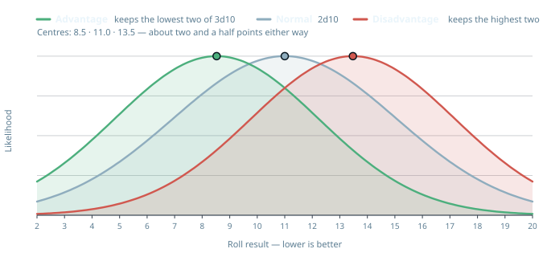

# Rules

## Core Mechanic

**Target number** = Attribute + Difficulty.

**Difficulty** is a number from **0-10**, set by the GM per roll - **0 is nearly impossible, 10 is trivially easy** (inverted from the usual "higher = harder" convention). See [Difficulty Chart](#difficulty-chart) below for the full 11-step ladder.

Roll **2d10** and sum them. Success if the result is **equal to or lower than** the target number.

Target number range: **1** (Attribute 1 + Difficulty 0) to **20** (Attribute 10 + Difficulty 10) - a target of 1 is below the lowest possible roll, i.e. an automatic failure, weighted toward the middle (11) rather than flat.

**Every Skill has a default Attribute/Element.** That default is what the roll uses unless the player challenges it. A player can challenge the default and pair the Skill with a different Attribute instead, provided they can argue the pairing to the GM's satisfaction - grounded in one of the character's own [Descriptors](#sub-stat-descriptors), a specific chosen flavor of a sub-stat ("I'm using Fire here instead of Firearms' default Air, because I'm being *Brutal* about it"), rather than an improvised justification from scratch. See [Skills](skills.md#skills-default-to-an-element) for the full rule.

### Difficulty Chart

An 11-step reference ladder for setting Difficulty, rather than picking a bare number cold, color-banded red (hardest) to blue (easiest):

| Difficulty | Label | Example task |
|---|---|---|
| 0 | Nearly Impossible | Catch an arrow out of the air mid-flight |
| 1 | Extremely Hard | Pick a masterwork lock with no tools, blindfolded |
| 2 | Very Hard | Scale a sheer, rain-slicked cliff face |
| 3 | Hard | Convince a hostile guard captain to stand down |
| 4 | Challenging | Track a careful quarry through a rainstorm |
| 5 | Moderate | A tense but ordinary skill check under pressure |
| 6 | Fairly Easy | Pick a simple lock with the right tools |
| 7 | Easy | Climb a sturdy rope with knots tied in it |
| 8 | Very Easy | Recall a well-known fact in your field |
| 9 | Nearly Trivial | Walk a straight line on level ground |
| 10 | Trivial | Tie your own shoes |

Per-Attribute example tasks (a Fire example vs. an Earth example at the same Difficulty) are deferred until the rest of the system is further along.

**Critical results, regardless of target number:**

- **A roll of 2** (both dice show 1) - critical success. In combat this has a specific effect, see [Critical Hits](#critical-hits).
- **A roll of 20** (both dice show 10) - catastrophic failure.

### Advantage / Disadvantage

**Advantage** rolls **3d10 and keeps the lowest two** (summed); **Disadvantage** rolls **3d10 and keeps the highest two** (summed) - roll-under, so lower is always better. Usable wherever a specific rule grants it - currently the [Expert/Master Skill Training Tiers](skills.md#training-tiers), a character's off-hand (below), but not restricted to those.

**Stacking**: count the sources. Each source of Advantage is **+1** and each source of Disadvantage is **-1**; add them up. **1 or more** rolls at Advantage, **0** rolls normally, **less than 0** rolls at Disadvantage. Neither one compounds - three sources of Advantage is still just Advantage, and the count only decides which side of zero you land on.

**Off-hand**: performing a task that requires manual dexterity or precision (attacking, fine manipulation, etc.) with your off-hand imposes Disadvantage on the roll. [Ambidextrous](boons.md#boon-list) removes this penalty.

### Untrained Rolls

If a character has no applicable Skill for the task, they still roll - but **the Attribute does not apply**. Target number is **Difficulty alone** (0-10), not Attribute + Difficulty. Having an applicable Skill is what lets the Attribute apply at all.

This is intentional: under the 2d10 curve, an untrained character faces poor odds at anything above Difficulty 5 or so, and Difficulty 0 (Nearly Impossible) is a flat impossibility untrained (target 0 is below 2d10's minimum roll of 2).

### Time Bands

A standard ladder of duration used wherever a rule needs to name "how long": **Round → Minute → Hour → Scene → Day → Month → Year → Decade → Century**. A **Round** is about **6 seconds**, so a Minute is exactly 10 of them. The **Round** is the base unit - any duration described elsewhere in the rules is stated in Rounds unless a longer band is explicitly named.

### Rests

Two recovery windows referenced throughout the rules - **Short Rest** and **Full Night's Rest** - anchored to real time. A **Short Rest** takes roughly **1 hour** of genuine downtime; only **one** Short Rest's worth of recovery can be gained between Full Night's Rests, no stacking a second hour spent resting for a second round of healing. A **Full Night's Rest** is a full, largely uninterrupted night's sleep.

## Ki

### Ki Infusion

Covers **all three attack types** - Physical, Social, and Mental - with the same shape and the same currency. The baseline attack die is raw and unboosted - `d10` vs. the defender's wall (Soak/Presence/Psyche as appropriate), so a wall of 10 fully negates it, guaranteed (0% connect). **Roll the attack's dice first, then spend.** With the dice on the table, the player picks which individual ones to boost and spends **1 Ki per die** - each boosted die adds the player's own matching sub-stat (**Ferocity** for Physical, **Presence** for Social, **Psyche** for Mental) to its result. A boosted die is compared as `d10 + [matching sub-stat]` vs. the wall, same threshold rule (result > wall connects).

Spending after the roll means no Ki is ever wasted - not on a die that already got through, and not on one too far under the wall for the sub-stat to save. It buys the same damage as committing blind would have, for roughly half the Ki.

This is a **direct Ki spend**, the same category as [spending Ki to preserve a Level](#ki-spend-to-preserve-a-level) and [Bump Action Bracket](fate.md#ki-the-pool) - **not** a Fate Token spend, so it does **not** count against [Stamina's per-Scene spend cap](fate.md#staminas-job).

Full negation is still the honest baseline: an unboosted attack against a maxed wall can never get through, but a player willing to spend Ki can crack even a Soak/Presence/Psyche of 10 - a boosted die with a matching sub-stat of 10 is a guaranteed connect, while a rating of 2 only gives a 20% chance per boosted die.

### Ki Spend to Preserve a Level

A player may spend **1 point from Ki** (the pool - distinct from [Fate Tokens](fate.md), the resource players earn/spend) to **cancel the loss of one Level from any of the [Vitals](#the-vitals---health-poise-sanity)** - Health, Poise or Sanity - at a cost of 1 Ki per Level preserved. Multiple Ki can be spent to preserve multiple Levels, even across more than one Vital from the same attack. All three work the same way here - a die that got through a wall costs a Level, and a point of Ki buys that Level back before it is lost.

## Attributes

### The Elements

Five attributes, each linked to a classical element. Each pairs a **domain** (narrative flavor) with a **mechanical role** (two sub-stats).

| Attribute | Domain | Mechanical Role |
|---|---|---|
| **Earth** | Physical power/endurance | Soak / Potence |
| **Air** | Agility/adaptability, mind/intellect | Initiative / Psyche |
| **Fire** | Drive/aggression | Ferocity / Presence |
| **Water** | Perception/empathy | Stamina / Health |
| **Moira** | Fate/destiny/the supernatural | Atropos / Klotho |

Attributes are scored **1-10** (1 = lowest, 10 = highest).

### Sub-Category Allocation

Every Attribute's Mechanical Role is **two sub-stats**. The Attribute's own score is **always the number used to roll** (see [Core Mechanic](#core-mechanic)) - it is never reduced or consumed by the split below.

Separately, that same score generates a **pool of points equal to the Attribute's rating**, which the player allocates across its two sub-stats - a player choice, not an even split. An Attribute of 10 both rolls as 10 *and* grants 10 points to divide, e.g. 7 Soak / 3 Potence, or 5/5, or any other division. What each allocated point actually *buys* in each sub-stat is defined case by case, sub-stat by sub-stat.

**This allocation is permanent.** Once a point is spent into a sub-stat, it's spent - there's no reallocating a pair's split later, same as Descriptors being fixed once chosen.

### Sub-Stat Descriptors

For every point a character allocates to a sub-stat, they gain one Descriptor - a short player-chosen word capturing one specific flavor of that sub-stat for this character. E.g. 3 points in Soak might yield *Hardy, Weathered, Unyielding* - three distinct ways the character shrugs off harm, not three copies of the same idea.

**Descriptors are core traits.** They're **free at character creation** (no separate cost beyond the point that earns them) and **fixed once chosen** - there is no way to buy an extra Descriptor beyond what a sub-stat's points earn, at creation or later. A character who wants a broader spread of Descriptors gets there by raising the sub-stat, not by purchasing the trait on its own.

Descriptors are one or two-word adjectives, not phrases - *Brutal*, *Brawny*, *Indefatigable*, *Headstrong*, not "Killer Instinct, Relentless, and Simmering Rage all at once." Tight, punchy, and easy to say out loud at the table.

**Every Skill defaults to an Attribute/Element** (see [Skills](skills.md#skills-default-to-an-element)). Descriptors are the concrete hook a player points to when challenging that default - grounding "I'm using Fire here because I'm being *Brutal*" in an established character fact instead of an improvised justification each time.

**Sample Descriptors**, 15 examples per sub-stat to jump-start character creation - these are just starting points, not a fixed list. A player is always free to write their own instead, as long as it's a short adjective capturing a real flavor of that sub-stat:

| Sub-Stat | Sample Descriptors |
|---|---|
| Soak | Hardy, Rugged, Stoic, Weathered, Unyielding, Sturdy, Grizzled, Armored, Callused, Thick-Skinned, Leathery, Battle-Worn, Steeled, Resistant, Flinty |
| Potence | Brawny, Herculean, Mighty, Strapping, Muscular, Titanic, Forceful, Robust, Hulking, Sinewy, Vigorous, Burly, Formidable, Stout, Iron-Armed |
| Initiative | Alert, Reflexive, Twitchy, Vigilant, Quickened, Sharp-Eyed, Instinctive, Keen, Fleet, Snappy, Watchful, Attentive, Sharp, Nimble-Minded, Anticipatory |
| Psyche | Steadfast, Composed, Disciplined, Unshaken, Focused, Resolute, Headstrong, Serene, Level-Headed, Calm, Iron-Willed, Grounded, Unflappable, Determined, Clear-Headed |
| Ferocity | Brutal, Savage, Relentless, Feral, Merciless, Ruthless, Vicious, Predatory, Fierce, Aggressive, Bloodthirsty, Wrathful, Untamed, Cutthroat, Rabid |
| Presence | Magnetic, Commanding, Charismatic, Radiant, Imposing, Captivating, Dominant, Alluring, Striking, Charming, Bold, Regal, Magnificent, Unforgettable, Larger-Than-Life |
| Stamina | Indefatigable, Tireless, Enduring, Hardened, Persistent, Unflagging, Dogged, Steady, Untiring, Unwavering, Gritty, Marathon-Bodied, Long-Winded, Driven, Unrelenting |
| Health | Hale, Vital, Resilient, Stalwart, Ironclad, Unbreakable, Durable, Tenacious, Hearty, Sound, Thriving, Hard-to-Kill, Long-Lived, Wholesome, Sturdy-Framed |
| Atropos | Fated, Untouchable, Uncanny, Ghostly, Warded, Veiled, Overlooked, Passed-Over, Unmarked, Inviolate, Unsevered, Thread-Bound, Unreachable, Spared, Unbroken |
| Klotho | Lucky, Charmed, Serendipitous, Auspicious, Star-Touched, Timely, Quickening, Renewing, Replenishing, Rekindling, Brimming, Deep-Welled, Spring-Fed, Ever-Spinning, Unspent |

### The Passive Wall Triad - Soak, Presence, Psyche

Every attack, regardless of type, resolves in the same two steps. **First, a to-hit roll**: the attacker's Attribute (Earth, Air, Fire, or Water - whichever fits the attack) against the target's [Defense for that attack type](#defense-derived-stat) as Difficulty, no Skill involved - a straight Attribute-vs-Defense roll, the same formula whether the attack is a fist, a threat, or a mind reaching where it isn't welcome. **Only a success reaches step two.** Then the attack's dice are resolved against the relevant wall stat, per die:

- **Soak** - wall against **Physical** damage dice.
- **Presence** - wall against **Social** attack dice.
- **Psyche** - wall against **Mental** attack dice.

Presence (Fire) and Psyche (Air) both mirror **Soak exactly** - the identical per-die mechanic, just resisting a different attack type. All three sub-stats are **passive gives**, the same way Health is: a flat number a character simply has, doing its job automatically with no roll or spend required.

For all three: each attack die is resolved individually against the relevant wall stat. Die ≤ wall stat is fully absorbed; die > wall stat connects. A wall stat of 10 guarantees 0% connect chance per die - true, complete negation - unless the attacker spends **Ki** (1 per die) to add their own matching Attack sub-stat to that specific die, per [Ki Infusion](#ki-infusion). A connecting Physical die costs a Health Level, a connecting Social die costs a Poise, a connecting Mental die costs a Sanity - the three together are your **Vitals**.

### The Vitals - Health, Poise, Sanity

The wall triad is what a die has to beat. The **Vitals** are what it costs when it does - the three things an attack can take from you, and the only three. Each is 5 plus a sub-stat, counted in Levels rather than points, and each runs the same distance below zero as it does above: see [Health Levels](#health-levels), [Poise](#poise) and [Sanity](#sanity) for what waits at each end of the row.

Ki is not a Vital. The Vitals are taken from you; Ki is the pool you spend, including to [preserve a Level](#ki-spend-to-preserve-a-level) on any of them.

### Choosing the Attacking Element

Which Element applies to a to-hit roll is set by **how the character is attempting the attack**, not by their weapon or a Skill - there are no weapon-specific attack skills. The same weapon can be used with any of the four elements depending on the approach described:

- **Earth - Force.** Overpowering the target through raw physical strength - *"I put my entire weight behind the blow and smash through his guard."*
- **Air - Precision.** Succeeding through speed, timing, or exploiting an opening - *"I wait for him to move his guard, then thrust through the opening."*
- **Fire - Intensity.** Overwhelming through aggression and ferocity - *"I charge him screaming and attack relentlessly, trying to force him back."*
- **Water - Adaptation.** Responding to the opponent and turning their action back on them - *"I let his attack pass, redirect his momentum, and strike when he overextends."*
- **Moira - Fate.** The opening that was always going to be there, taken - *"I say the thing he has been afraid somebody would notice."* **Social and Mental attacks only.**

The first four examples all use the same sword - the weapon never determines the element. **Moira never governs a Physical attack**: fate does not swing a blade, and no amount of luck makes a bat hit harder. It carries a Social or Mental attack readily, because finding the one word that lands is exactly what fate is for. Atropos only ever sets Defense, whatever the attack.

The player describes the attempt **before** rolling, and the GM confirms which element fits - not chosen retroactively to fish for a better number. This choice only sets which Attribute feeds the to-hit roll; it's not a second roll, doesn't change the attack's category (Physical/Social/Mental), and doesn't change what damage the weapon deals.

**What does set the category is the attack itself.** A weapon deals Physical dice against Soak no matter which Element carried the to-hit; a Gift deals whatever its own entry states; and [Signature Move](gifts.md#signature-move) is built with its attack source and its target wall chosen independently, so a Presence-powered Move can resolve against Soak. The Element is approach. The wall is category.

### Earth

#### Physical Attacks - Weapon Damage & Per-Die Resolution

After the attacker's [to-hit roll](#the-passive-wall-triad---soak-presence-psyche) succeeds, the **weapon in use sets how many d10 are rolled** - see [weapons.md](weapons.md) for the base list. **Each die is resolved individually against the defender's Soak**, not summed together:

- **Die result > Soak** - that die connects, and costs the defender **one Health Level**.
- **Die result ≤ Soak** - that die is fully absorbed, no effect.

**Soak 10 guarantees 0% connect chance per die - true, complete negation.** A heavier weapon (more dice) doesn't overwhelm Soak mathematically - it just means **more independent chances to connect**, so a single attack can plausibly cost a defender **multiple** Health Levels at once if several dice connect (subject to the [crossing-zero throttle](#health-levels) once the defender is already at 0).

#### Armor & Called Shots

Worn or carried armor (see [Weapons & Equipment](weapons.md#armor)) has its own **Hardness** (a threshold on the same 0-10 scale as Soak) and its own **Health Levels**, both tracked separately from the wearer's. Every armor item covers one or more of four **Zones**: **Center of Mass**, **Head**, **Arms** and **Legs**. An item that covers several Zones is still one item, with one Hardness and one set of Health Levels, whichever Zone a die arrives at.

While it still has Health Levels remaining, armor intercepts every die aimed at the Zone it covers, before the wearer's own Soak ever comes into play:

- **Die result ≤ Hardness** - deflected for free. No effect on the wearer, no cost to the armor.
- **Die result > Hardness** - still fully stopped, the wearer takes nothing - but the armor takes the hit instead. **An armor item never loses more than 1 Health Level per attack**, no matter how many of that attack's dice exceeded its Hardness.

**Once an armor item's Health Levels reach 0, it's broken.** It stops covering its Zone entirely - dice resolve straight against the wearer's own Soak, per the normal per-die rule above - until repaired (a downtime/GM-adjudicated task, not modeled further here).

**Ki Spend to Preserve** (see [above](#ki-spend-to-preserve-a-level)) only ever applies to the wearer's own [Vitals](#the-vitals---health-poise-sanity) - it can't prevent or undo an armor Health Level loss.

- **Armor doesn't stack within a Zone.** If a character owns more than one item covering the same Zone, only one can be worn there at a time - their choice which.
- **A normal attack always resolves against Center of Mass armor.** Armor that covers only the Head, Arms or Legs does nothing against it.
- **A called shot** - an attack aimed at something specific rather than at the target generally: a hand, a knee, a strap, a weapon, a sensor. It's an [empowered action](movement.md#empowered-actions) - declared as a [Slow Action](#action-brackets), with **no Advantage** (Aim is the empowered action that gives Advantage) - and spending Ki to [bump the bracket](#action-brackets) carries it along rather than cancelling it. What a successful called shot accomplishes is the GM's call, and depends on what was aimed at. Where it interacts with armor, a called shot to the **Head**, **Arms** or **Legs** resolves against whatever the defender wears on that Zone (or no armor at all, if nothing covers it), and armor that covers only the Center of Mass doesn't apply to it.

#### Potence

Potence (Earth's other sub-stat: raw physical power/strength - carrying capacity, immovability, mass, forcing/breaking things) splits into two jobs:

1. **Flat passive give (mundane use, no roll)** - Potence directly sets a **Carrying Capacity** and a **Break Threshold**.
   - **Carrying Capacity** (how much weight a character can lift/carry/drag under ordinary conditions): `Potence² × 10`, in kg.

     | Potence | Carrying Capacity |
     |---|---|
     | 1 | 10 kg (~22 lbs) |
     | 2 | 40 kg (~88 lbs) |
     | 3 | 90 kg (~198 lbs) |
     | 4 | 160 kg (~353 lbs) |
     | 5 | 250 kg (~551 lbs) |
     | 6 | 360 kg (~794 lbs) |
     | 7 | 490 kg (~1,080 lbs) |
     | 8 | 640 kg (~1,411 lbs) |
     | 9 | 810 kg (~1,786 lbs) |
     | 10 | 1,000 kg (~2,205 lbs) |
   - **Break Threshold** (the bar an object's resistance must sit under to be forced open/broken with no contest involved): no separate number, just a direct comparison. If a character's **Potence is equal to or greater than the target item's [Hardness](#materials-hardness-and-health-levels)**, it breaks or forces open automatically, no roll. If Potence is lower, it isn't a no-contest job anymore; that's what the contested dice pool below is for.
2. **Contested dice pool** - when forcing, breaking, or moving something that's actively resisting (a grapple, a door someone's holding shut, a struggling creature), **Potence itself sets how many d10 are rolled**. Each die is compared individually against the target's relevant resistance: a grappled/restrained creature's own **Soak**, or - for inanimate resisting things - the item's own **Hardness** (GM-set, on the same 0-10 scale as Soak - see [Materials](#materials-hardness-and-health-levels)). Each connecting die represents one increment of success, costing the object one of its **Health Levels** - same binary hit-box shape as a character's, just scaled to the object's durability instead of a body.

#### Materials: Hardness and Health Levels

Living bodies have **Soak**. Items and armor have **Hardness**, on the same 0-10 scale. The numbers below are for a piece about the size of a person: a door, a section of wall, a car door.

- **Attacking or breaking an item** costs it one Health Level for each die over its Hardness. At 0 it's broken. Armor that is shielding someone is the exception: it never loses more than one Health Level per attack - see [Armor & Called Shots](#armor--called-shots).
- **Cover can be shot down, where that's plausible** (GM's call). Attack the cover as an item; at 0 Health Levels it stops being cover. A knife won't dig through a concrete wall, and a pistol won't move a boulder.

| Material | Hardness | Health Levels | Examples |
|---|---|---|---|
| Paper, cardboard, cloth, canvas | 0 | 1 | Tent wall, curtain, boxes |
| Packed snow | 1 | 3 | Snowbank, snow wall |
| Plain glass | 1 | 1 | Window, glass door |
| Rope, zip ties | 2 | 1 | |
| Drywall | 2 | 2 | Interior wall |
| Light wood | 2 | 2 | Chair, fence board |
| Ice | 3 | 2 | Frozen pond, ice sheet |
| Thin wood | 3 | 2 | Interior door, table |
| Chain-link, cheap locks | 3 | 1-2 | Fence, padlock |
| Sandbags, packed earth | 4 | 4 | Berm, sandbag wall |
| Hardware steel | 4 | 1 | Handcuffs, a chain |
| Sheet metal | 5 | 3 | Car door, vending machine |
| Solid wood | 5 | 3 | Reinforced exterior door, tree trunk |
| Brick | 6 | 4 | House wall, chimney |
| Stone | 7 | 5 | Boulder, stone wall |
| Steel plate | 7 | 4 | Security door, dumpster |
| Bulletproof glass | 7 | 3 | Bank teller window |
| Reinforced concrete | 8 | 5 | Bunker, parking garage pillar |
| Vault steel | 9 | 6 | Bank vault door |
| Fortress stone | 9 | 8 | Castle gate, fortress wall |
| Modern vault | 10 | 8 | High-security vault |

### Air

#### Mental Attacks - Gift-Sourced Only

A Mental attack resolves exactly like a [Physical](#physical-attacks---weapon-damage--per-die-resolution) or [Social](#social-attacks---training--per-die-resolution) one: [to-hit](#the-passive-wall-triad---soak-presence-psyche) with the fitting **[Mental Defense](#defense-derived-stat)** (`10 − Presence`) using the fitting [Element](#choosing-the-attacking-element), then dice resolved **individually** against their **Psyche**, a connecting die costing **one [Sanity](#sanity)**. [Ki Infusion](#ki-infusion) adds the attacker's own Psyche, 1 Ki per die.

**There is no baseline dice source, and this is deliberate.** A weapon gives Physical dice and a [Training Tier](#social-attacks---training--per-die-resolution) gives Social dice; nothing gives an ordinary character Mental dice. The pool has to come from one of:

- a **[Gift](gifts.md)** that states one - including a [Signature Move](gifts.md#signature-move) built to resolve against Psyche, since a Signature Move is a Gift;
- a **creature's own stated pool** - see the adversary stat blocks, where a Nightmare's Cry is dice pool 6 and needs no to-hit roll at all.

**Psyche is therefore the one wall a character without a Gift can never test.** A fist and a bad word are standard human equipment; a mind that pushes on another mind is not. Treat a player asking how to attack Psyche unaided as answered - they can't - rather than as a gap to house-rule around.

#### Sanity

Sanity mirrors Health Levels too, tracking a character's grip on their own mind against Mental attack.

- **`PC Sanity = 5 + Psyche`.** NPCs default to a flat 5. Each Level is a binary hit-box.
- **Crossing zero** works identically to Health Levels.
- **The negative range mirrors the positive one**, exactly as [Health Levels](#health-levels) and [Poise](#poise) do: a character with 9 Sanity is Overwhelmed at 0 and Shattered from −1 down to −8. **Reaching −(full Sanity) is the floor.** The character picks up a temporary mental health condition - the same mechanic Overwhelmed's own trait uses, still to be defined - and Sanity resets to **0**: Overwhelmed again, not restored. The permanent mental scar from having gone below 0 stands regardless.
- **General recovery** matches Health/Poise: Short Rest heals `Psyche ÷ 2` (round up, minimum 1); Full Night's Rest heals fully.

**At 0 Sanity, a character is Overwhelmed**: they gain a temporary negative mental trait (a Flaw - exact mechanic to be defined later) and are at Disadvantage on rolls. They can still act on their own. Overwhelmed clears when the character is removed from the stimulus that caused it and given a chance to rest, or by spending 1 Ki, which also refills Sanity to full.

**Below 0, a character is Shattered**: panicky, babbling, unable to act on their own - they have to be led or dragged. Shattered clears when 1 Ki is spent or a Short Rest or Full Night's Rest passes, either of which restores Sanity only to 1, not fully - normal recovery resumes from there on the next rest.

**Mental scars**: dropping to 0 Sanity leaves a purely cosmetic mental tell (a tic, an intrusive thought, a private ritual), no mechanical effect beyond Overwhelmed's own temporary trait above. **Dropping below 0 always leaves a permanent mental scar**, regardless of how the character recovers afterward - even a Ki-funded refill doesn't erase it. This scar can instead be a genuine, lasting [Flaw](flaws.md), GM's call in consultation with the player on which fits (Anxiety, Short Fuse, Amnesia, Soft-Hearted, Overconfident, and Secret are natural fits), distinct from Overwhelmed's own temporary trait and lasting until Sanity is healed back to 0 the slow way - same shape [Battle Scars](#battle-scars) and [Poise](#poise)'s below-zero rule both use.

### Fire

#### Social Attacks - Training & Per-Die Resolution

A social attack resolves exactly like a [Physical one](#physical-attacks---weapon-damage--per-die-resolution): [to-hit](#the-passive-wall-triad---soak-presence-psyche) against the target's **[Social Defense](#defense-derived-stat)** (`10 − Psyche`), then damage dice resolved **individually** against their **Presence**, a connecting die costing **one [Poise](#poise)**.

**The dice come from the attacker's Training Tier** in whichever [Skill](skills.md#training-tiers) they are using. A weapon sets Physical dice because anyone can pick one up; nothing on a character sheet says how hard a sentence hits, so the number is what they have practised.

| Tier | | Dice |
|---|---|---|
| 0 | Untrained | **1** |
| 1 | Novice | **2** |
| 2 | Trained | **3** |
| 3 | Adept | **4** |
| 4 | Expert | **5** |
| 5 | Master | **6** |

Untrained rolls 1 for the same reason bare fists do. Master reaches 6, one past the heaviest ordinary weapon in [weapons.md](weapons.md), and that is deliberate: Poise has no death threshold, so nothing on this ladder can kill.

**The Skill also sets the Element.** Every Skill has a home Element ([skills.md](skills.md#skills-default-to-an-element)), so naming what you are doing settles the dice and the to-hit Attribute together. **Fire** carries Ridicule, Intimidation, Persuasion, Public Speaking, Performance, Leadership and Deception; **Moira** carries Insight. A Descriptor can still argue for a different Element, as with any Skill roll.

**Charm and Seduction are not attacks.** They win a target over rather than take them apart, and cost no Poise. Etiquette is the GM's call: in a room where protocol matters, naming the one somebody just broke is a weapon.

[Ki Infusion](#ki-infusion) applies as it does to any attack - 1 Ki per die, adding the attacker's own **Presence** to that die.

**The dozens** is this rule run in alternation: two people trade attacks in front of a crowd nobody can walk out of, and it grinds. First participant to 0 Poise is [Flustered](#flustered); below 0, [Humiliated](#humiliated).
#### Poise

Poise mirrors [Health Levels](#health-levels), tracking composure under Social attack instead of Physical.

- **`PC Poise = 5 + Presence`.** NPCs default to a flat 5. Each Level is a binary hit-box, same shape as Health.
- **At 0 Poise**, a character becomes [Flustered](#flustered).
- **Crossing zero** works identically to Health Levels: a single attack can never carry a character straight past 0 into negative territory - excess connecting dice are discarded, landing exactly at 0. Once already at 0, any further attack can only remove 1 Poise, total, regardless of how many dice connect.
- **Below 0 Poise**, a character becomes [Humiliated](#humiliated). **There is no death threshold for Poise** - social trauma can leave lasting damage, but never kills on its own.
- **The negative range mirrors the positive one**, exactly as [Health Levels](#health-levels) do: a character with 8 Poise is Flustered at 0 and Humiliated from −1 down to −7. **Reaching −(full Poise) is the floor.** Poise resets to **0** - Flustered again, not restored - and the character takes **1 [Sanity](#sanity) Level**.
- That Sanity Level **bypasses the Psyche wall entirely**; no die is rolled against it. This is not an attack on the mind, it is standing collapsing into it, and the armour for one is not the armour for the other. It can still be prevented by [Ki Spend to Preserve a Level](#ki-spend-to-preserve-a-level), the same as any other Level. **A wall of 10 is not immunity** - [Ki Infusion](#ki-infusion) cracks it like any other, it simply costs the attacker more than the point is worth.

**Recovery**: Short Rest heals `Presence ÷ 2` (round up, minimum 1); Full Night's Rest heals fully. **Below 0**, see the refill rule below: either rest, or 1 Ki, brings Poise back to **1**.

**There is no full refill.** Ki buys a Poise Level back as it is lost, the same as Health or Sanity - see [Ki Spend to Preserve a Level](#ki-spend-to-preserve-a-level). **Below 0, spending 1 Ki - or taking a Short Rest or Full Night's Rest - restores Poise to 1, not to full**, exactly the shape [Sanity](#sanity)'s Shattered recovery uses; normal recovery resumes from there.

**Poise scars**: dropping to 0 leaves a purely cosmetic social tell (a nervous habit, a reputation quirk), no mechanical effect. No Gift currently grants immunity to this - intentional. **Dropping below 0 - and certainly reaching the floor - can instead impose a genuine [Flaw](flaws.md)**, lasting until Poise is healed back to 0 the slow way - GM's call, in consultation with the player, on which Flaw fits (Notoriety, Pariah, Secret, Speech Impediment, Short Fuse, and the purpose-built [Shaken Confidence](flaws.md#shaken-confidence) are natural fits).

### Water

#### Health Levels

**Health Levels are a count of discrete hit-boxes**, not a numeric HP pool. Each Health Level can absorb damage **once** - a binary hit-box, not a container with its own capacity.

Every character starts with **5 Health Levels**, flat, before anything else is added.

- **`PC Health Levels = 5 + Health (sub-stat)`** - the flat baseline, plus whatever a PC invests in Water's Health sub-stat.
- **NPCs will most often just be the flat 5**, with no Health sub-stat added - minor/"weenie" NPCs go down in a single connecting hit, while PCs are built tougher by default.

At **0 Health Levels**, a character falls unconscious and can't act. **Below 0 they are Dying**: still unconscious, still losing ground, and out of the fight until something stops it. Health Levels can still be tracked into negative territory from further damage, and **the negative range mirrors the positive one** - a character with 7 Health Levels is unconscious at 0, Dying from −1, and dead at −7. Whatever it took to put them down, it takes that much again to finish them. Ordinarily that range plays out off-screen, since an unconscious character can't act or be aware of it; [Unstoppable](boons.md#boon-list) is the exception that lets a character stay conscious and act throughout it instead of blacking out at 0.

Falling unconscious at 0 is unconditional - it happens on the way down no matter how tough a character is. **The symmetry below zero is the point.** Everyone gets the same second chance their own toughness already earned them, rather than a separate allowance bolted on beside it. A character who put nothing into Health still has five Levels and five more below zero: quick to drop, but never one unlucky round from a funeral because of a choice made at creation. Every point of Health is still worth two hits - one before they drop, one after.

**Crossing zero**: a single attack can never carry a character straight past 0 into negative territory. If enough connecting dice from one attack would carry a character's Health Levels below 0, the excess is simply discarded - they land exactly at 0, no further, no matter how many dice connected. **Once a character is already at 0 Health Levels** - unconscious under the rule above, or still conscious via Unstoppable - **any further attack can only remove 1 Health Level, total, regardless of how many dice connect.**

#### Health Level Recovery

- **Short Rest**: heal Health Levels equal to your Health sub-stat divided by 2, round up, minimum 1.
- **Full Night's Rest**: heal all lost Health Levels, back to full.
- **Reduced below 0 Health Levels**: the rates above stop applying. A Short Rest recovers **nothing**. A Full Night's Rest recovers **1 Health Level**, and only one, until back to 0.

#### Battle Scars

Dropping to 0 Health Levels leaves a permanent mark - a scar, a limp, a changed voice, whatever fits the wound. **Purely cosmetic, no mechanical effect.** The [Healing](gifts.md#healing) and [Regeneration](gifts.md#regeneration) Gifts both grant immunity to it, for the target they're used on.

Dropping below 0 Health Levels can instead impose a genuine [Flaw](flaws.md), lasting until the character is fully healed back to 0. GM's call, in consultation with the player, on which Flaw fits the harm taken.

**Scars accumulate** - each fresh crossing of a 0 or below-0 threshold (Health, Sanity, or Poise), after healing back up in between, adds a new scar rather than replacing the last one. A below-zero Flaw-scar grants no Flaw points of its own - it's a consequence the GM imposes, not a creation-time build choice. Healing and Regeneration's immunity (above) only ever covers the cosmetic tier - it can't prevent or undo a below-zero Flaw-scar. That Flaw-scar can instead be healed away entirely given a full **Month**: see [Regeneration](gifts.md#regeneration) and [Healing](gifts.md#healing) for how each Gift handles it.

### Moira

#### Klotho

Two passive functions, both "gives" like Health/Soak/Presence/Psyche - no roll, no spend:

1. **Ki Regeneration** - a Short Rest restores `Klotho` Ki (minimum 1); a Full Night's Rest restores Ki fully. See [Ki's refill](fate.md#ki-the-pool).
2. **Lucky Number** - a character's lucky number equals their **Klotho rating**. Whenever the result of one of the character's own core rolls - the [core roll](#core-mechanic)'s 2d10 or an Advantage/Disadvantage 3d10 - equals their Klotho rating, they immediately gain **1 Fate Token**, automatic, no choice, no cost, and never more than one per roll. It's the roll's result that has to match, not any individual die within it - does not apply to damage dice pools (weapon dice, Gift dice, the Potence contested dice pool, or any other bulk multi-die pool resolved per-die against a wall).

#### Defense (Derived Stat)

**Defense** is how hard a character is to *reach* - the to-hit target, before any wall is involved. There are **three of them**, one per attack type, each derived from a different sub-stat:

| Attack | Defense | Sub-stat | Why |
|---|---|---|---|
| **Physical** | `10 − Atropos` | Moira | Fate. The blade goes where the thread says it goes. |
| **Social** | `10 − Psyche` | Air | Composure. A remark only lands if it can get a rise out of you. |
| **Mental** | `10 − Presence` | Fire | Self. A mind reaching in finds the room already occupied. |

**No sub-stat both deflects an attack and walls it.** Soak walls Physical, Presence walls Social, Psyche walls Mental - and none of those is the sub-stat that set the to-hit target for its own attack type. Presence walls Social but deflects Mental; Psyche walls Mental but deflects Social. Each attack type is therefore answered by two numbers drawn from two different Elements.

That separation is the point. A single sub-stat doing both jobs would dominate every build - measured at a 3-die social attack, folding the wall and the to-hit into Presence widened the spread between Presence 0 and Presence 6 from 2.5x to 5.9x. Split, being hard to insult and being unbothered once an insult lands are two separate purchases.

Defense becomes the attacker's Difficulty (see the [Difficulty Chart](#difficulty-chart)); since Difficulty runs 0 (hardest) to 10 (trivial), the subtraction inverts correctly: sub-stat 0 → Defense 10 (trivial to reach), sub-stat 10 → Defense 0 (nearly impossible).

## Combat

### Critical Hits

A critical doesn't add dice. It decides them.

**Half the attack's dice, rounded up, connect automatically** - no roll, no wall, nothing to beat. A weapon throwing 5 dice lands 3 before anything hits the table, and a wall of 10 stops them exactly as well as a wall of 1 does, which is to say not at all.

**The rest roll, and each adds your Klotho.** This is amplification, not an attack - the to-hit was made with an Element like any other and has already landed; Klotho only decides how much of it gets through, the same way [Ki Infusion](#ki-infusion) adds Ferocity to a die without Fire having thrown the punch. **Moira still never attacks.** What it does here is what it always does: bend the outcome of something already in motion. Ki Infusion still works on those rolled dice on top of Klotho, 1 Ki per die, adding the matching sub-stat as usual.

A creature has no Klotho. Its critical is the automatic half, and the rest roll unaided.

| Weapon dice | Connect free | Then roll, +Klotho each |
|---|---|---|
| 1 | 1 | - |
| 2 | 1 | 1 |
| 3 | 2 | 1 |
| 4 | 2 | 2 |
| 5 | 3 | 2 |

A critical still cannot kill on its own. The [crossing-zero](#health-levels) rule applies to the free dice and the rolled ones alike: however many connect, a single attack can only ever bring a target to **0**, never past it. Against a player character, or anyone else who survives being dropped, a critical is what takes them out of the fight rather than what ends their life.

Note that the [Skill Training Tiers](skills.md#training-tiers) that widen the critical range do **not** apply here: an attack is a straight Attribute-vs-Defense roll with no Skill involved, so a critical hit lands on a natural 2 for everyone. What does move the odds is **Advantage** - which a [Slow action](#action-brackets) grants, taking a critical from a 1% chance to roughly 2.8%.

### Combat Order

1. **Initiative** - rolled **once at the start of combat**, not re-rolled each round: **1d10 + Initiative** (sub-stat). Higher total acts first. This base order holds for the whole fight.
2. **Declare Action Bracket** - each character declares which of the three bands they're acting in this round: **Fast**, **Normal**, or **Slow** (see below).
3. **Resolve band by band** - all **Fast**-band characters act first, then all **Normal**-band characters, then all **Slow**-band characters. Within each band, characters act in Initiative order.

#### Action Brackets

| Band | Also called | Actions | Notes |
|---|---|---|---|
| **Fast** | Reactive | One action | A move, an attack, a single Skill use - or a [special action](movement.md#special-actions) such as Attack on the Run. Acts first, but only gets the one action. |
| **Normal** | Active | Two actions | E.g. a move and an attack. Acts second. |
| **Slow** | Measured | One action, with concentration | Acts last, but the single action is an [empowered action](movement.md#empowered-actions) - Aim for **Advantage**, a Called Shot, Study a Target, and others - plus a 1m step. (Once magic exists, all spellcasting is a Slow action.) |

The tradeoff across all three: **Fast trades action count for going first**, **Normal is the balanced middle (two actions, middling position)**, **Slow trades speed for a single, more powerful, concentrated action**.

A player can spend **1 Ki per step** to bump their declared band up (Slow → Normal, or Normal → Fast) - buying back speed at the cost of the resource. Spending 2 Ki moves two steps at once (Slow → Fast).

#### Combat Actions

The full list - combat actions, [empowered actions](movement.md#empowered-actions) and [special actions](movement.md#special-actions) - is in [Movement: Actions](movement.md#actions): Dash, Reckless, Full Defense, Reload, Grab, Disarm, Help, Ready, and the small actions. A Gift or weapon that states its own action cost always overrides them.

#### Movement & Range

**Movement Rate**: `5 + Air`, in **meters** - the same flat-floor-plus-Attribute shape as [Health Levels](#health-levels). **Range Bands**: Melee (contact, out to ~1m), Close (1 to 10m), Near (10 to 50m), Far (beyond 50m). Everything else - moving in a round, leaving Melee, cover, terrain, climbing, jumping, swimming, chases and travel, for theater of the mind and a 1m-hex map alike - is in [Movement](movement.md).

*The status effects defined so far - [Off Balance](#off-balance), [Distracted](#distracted), [Surprised](#surprised), [Flustered](#flustered), [Humiliated](#humiliated), [Exhausted](#exhausted), [Staggered](#staggered), [Blinded](#blinded), [Deafened](#deafened), [Grabbed](#grabbed), [Prone](#prone), [Frightened](#frightened), [Envenomed](#envenomed) and [Bleeding](#bleeding), plus [Overwhelmed and Shattered](#sanity), which Sanity defines. More are expected as combat rules develop further; this isn't the full list.*

#### Off Balance

A character who rolls a **catastrophic failure** on any roll during combat becomes **Off Balance** until the end of their next turn, in addition to whatever else that failure caused.

**An Off Balance character rolls everything at Disadvantage.** The condition does not stack - a character is either Off Balance or is not, however many catastrophic failures they roll in a round - and it clears on its own with no action or roll required.

A Fate Token spent on [Shrug Off an Effect](fate.md#fate-triggers) clears it immediately. That spend never undoes the separate consequence the catastrophic failure caused. [Never Off Balance](boons.md) grants a reroll of the triggering failure itself.

#### Distracted

A character who loses a Health Level or is the target of a Kotodama effect while resolving a **Slow** Action Bracket action becomes **Distracted**, and must roll **Atropos + Difficulty** to hold focus.

- **Success** - the action resolves as declared.
- **Failure** - the action downgrades to a **Normal** action, and loses whatever its [empowerment](movement.md#empowered-actions) gave.

**Other sources can impose Distracted too** - a Gift, an environmental hazard (a collapsing building, a deafening explosion), or GM fiat, whether or not a Slow action is involved. The same **Atropos + Difficulty** roll applies; outside a Slow action, failure instead imposes **Disadvantage** on the triggering roll. [Concentration](boons.md) grants immunity to being Distracted regardless of source.

#### Surprised

A character who hasn't noticed a threat before combat begins is **Surprised** - typically because they failed to spot it: a Perception roll against the threat's Stealth, which a creature lists as the Difficulty (`Stealth 6 vs. Perception` - see [how to read a stat block](adversary-index.md)), or an opposing character's Stealth roll. The GM can also judge that the fiction warrants it.

**A Surprised character rolls at Disadvantage on everything** - attacks, and any other roll where the defender's readiness matters - for the remainder of the round they're caught in. Ends automatically once that round ends. [Alertness](boons.md) grants immunity to being Surprised while conscious.

#### Flustered

A character whose [Poise](#poise) reaches 0 becomes **Flustered**.

**A Flustered character rolls at Disadvantage on all Social rolls**, and on any other roll where composure matters (GM's call, same standard as Surprise), for the rest of the Scene.

A Flustered character may spend an action to roll **Presence + Difficulty** to shake it off early, ending the condition immediately on success.

#### Humiliated

A character whose [Poise](#poise) drops below 0 becomes **Humiliated** - a step past Flustered.

**A Humiliated character can't take the lead, negotiate, or be trusted to speak for the group** - socially deferring and complying rather than asserting themselves. Unlike Shattered (see [Sanity](#sanity)), a Humiliated character still acts fully on their own; this is social paralysis, not physical.

Humiliated clears once Poise is restored back to 0 (see [Poise recovery](#poise) - Ki, a Short Rest or a Full Night's Rest each only restore it to 1 while still below 0, never to full).
#### Exhausted

The only Condition that **stacks**, in levels **1-5**. Taken from pushing an effort past what [Stamina](fate.md#staminas-job) covers, or from [cold or heat](#common-hazards). Effects are cumulative:

| Level | Effect |
|---|---|
| **1** | Disadvantage on Physical rolls |
| **2** | Disadvantage on **all** rolls |
| **3** | Movement Rate halved; **no Fast actions** |
| **4** | Every Ki spend costs **+1** |
| **5** | Unconscious, until warmed, cooled, or rested |

A **Short Rest** clears one level; a **Full Night's Rest** clears all of them. A level taken from an environment cannot be cleared while the character is still in it - resting in the cold does not clear cold.

#### Staggered

Something has knocked the rhythm out of a character: a blow that lands wrong, a shock, a moment of not knowing which way is up. Whatever causes it says so.

**A Staggered character's declared [Action Bracket](#action-brackets) drops one step** - Fast becomes Normal, Normal becomes Slow. A character who declared Slow still acts, but loses whatever their [empowered action](movement.md#empowered-actions) would have given.

**Ki buys it straight back at the usual rate**: 1 Ki per step, the same spend that bumps a band up in the first place. Otherwise it clears at the end of that character's next turn. Staggered does not stack - a second source while already Staggered does nothing further.

#### Blinded

A character who cannot see: darkness they have no answer for, a flash, a faceful of something.

**A Blinded character rolls at Disadvantage on anything that needs sight**, and neither uses nor suffers any effect that requires seeing or being seen - no eye contact, no reading the room, no Gift that depends on the target looking at them.

Ends with whatever caused it. [Heightened Senses](gifts.md#heightened-senses) can sidestep it entirely.

#### Deafened

A character who cannot hear: an explosion, a pressure wave, water, a Gift.

**A Deafened character rolls at Disadvantage on anything that needs hearing**, and neither uses nor suffers any effect that has to be heard to work.

Ends with whatever caused it. A Deafened character can still speak, so a [Kotodama](fate.md#kotodama) of their own is unaffected.

#### Grabbed

Held: a hand, a jaw, a coil, a will.

**A Grabbed character's Movement Rate is 0, and they roll at Disadvantage on everything except escaping or attacking whatever holds them.**

Escaping is a contested roll against the grabber's **Potence** - or against its Hardness where the grip is a thing rather than a person, GM's call - the same contest [Psychokinesis / Telekinesis](gifts.md#psychokinesis--telekinesis) already uses.

#### Prone

Knocked flat: put there by a blow, a fall, or footing that gave out. **Prone is always inflicted.** Going down on purpose is [Belly Down](movement.md#getting-low), which is a different thing.

**A Prone character can't attack, and every attack against them gains Advantage.** They can't Crawl.

**Recovering from Prone costs one action**, which is a Fast character's entire turn.

#### Frightened

Something is too much to face. Frightened always has a source, and the condition is of that source rather than of the world in general.

**A Frightened character rolls at Disadvantage against the source, and cannot willingly move closer to it.** They can still fight it if it comes to them, still run, still act normally on everything else.

Ends when the source can no longer be perceived, or at the end of the Scene, whichever comes first.

#### Envenomed

Venom, toxin, or a drug in the blood. Venomous creatures in the [bestiary](adversary-index.md) impose it on a successful hit, and each entry says so.

**An Envenomed character rolls at Disadvantage on Physical rolls, and it does not clear on a rest.** The body cannot sleep this one off.

**Once a day, starting the day after, roll Water + 8. One success ends it.** The roll is never at Disadvantage, from Envenomed or anything else, and a successful Medicine roll by whoever is tending the victim that day gives it **Advantage**. Medicine never ends it on its own.

**[Antitoxin](weapons.md) always ends it. Ki cannot.** A creature whose venom works differently says so in its own entry: the [recluses](adversary-index.md#spider), for one, take three successes to shake off.

A creature that envenomates and holds on imposes Envenomed and [Grabbed](#grabbed) together, rather than needing a rule of its own.

#### Bleeding

An open wound that keeps costing after the attack that opened it. The effect that causes it says so.

**A Bleeding character takes 1 die against [Soak](#earth) at the end of each round**, resolved per-die like any other attack, a connecting die costing a Health Level as usual.

Stopping it takes a Normal action, spent by the character or by somebody who reaches them, or any Gift that closes wounds. [On fire](#common-hazards) is the same shape at 2 dice per round.

#### Common Hazards

Environmental damage uses the same per-die machinery as an attack, resolved against **Soak**, a connecting die costing one [Health Level](#health-levels). The [weapon table](weapons.md) is the scale: fists 1, knife 3, anti-materiel rifle 5.

| Hazard | Dice |
|---|---|
| **Falling** | **1 per 4m**, capped at 5. Halved for water, deep snow, or similar |
| **Burning room** | **1** per round, at the end of each round in it |
| **On fire** | **2** per round until extinguished (a Normal action, or a Fast one from a helper) |
| **Vehicle, city speed** | **3** |
| **Vehicle, at speed** | **5**. Faster than that isn't a roll |

**No air** (drowning, smoke, suffocation) is the exception: the character lasts **Stamina rounds**, then loses **1 Health Level per round** with **no dice and no Soak** - there is nothing to soak.

**Cold and heat cost [Exhausted](#exhausted) levels, not Health.** Appropriate gear negates cold entirely.

| Exposure | Rate |
|---|---|
| Underdressed for cold | 1 level / hour |
| Wet, windy, or ~-20&deg; | 1 level / half hour |
| Immersed in cold water | 1 level / minute |
| Hard exertion in real heat | 1 level / hour |
| Without water | 1 level / hour regardless of exertion; nothing clears until they drink |
| Enclosed, airless, unshaded heat | 1 level / half hour |

Exposure kills by reaching **Exhausted 5** - unconscious - rather than by spending Health, which is how a blizzard threatens a character nobody has touched.

#### Corruption

Something has gotten its hooks into you: a presence, an otherworldly thing, a place. It changes you slowly. At first you don't notice it. Eventually, you don't mind.

Corruption is not damage and not a Vital. It is its own track, **0 to 5**, kept **separately for each source**: Corruption (the lake), Corruption (the radio). Being Corrupted by one thing does nothing to your standing with another.

**Building a source.** The GM decides five things when a source of Corruption enters the game:

- **Intensity** - **1 to 5 dice**, on the same scale as everything else: 1 is a lingering wrongness, 5 is something that should not exist.
- **Exposure** - how it gets in: seeing it, touching it, breathing or eating it, sleeping near it, or simply being near it.
- **Schedule** - **once, on contact** (a touch, a look, a mouthful), or **once per Day, Hour or Minute** while exposed, on the same [Time Band](#time-bands) ladder as [cold and heat](#common-hazards).
- **Its signs** - what its Tell looks like, what its Pull wants, and what its Mark is.
- **Its cure** - the rare thing that clears Marked. Somebody in the world knows it. Finding them is the story.

**Each exposure**, roll the source's dice against your **[Klotho](#klotho)**. **If any die gets over it, gain 1 level of Corruption** - one level, however many dice got over. A bigger source catches you more often, not further. **A rare source is stronger than that, and says so when it is built**: with it, each die that gets over adds a level.

| Level | Name | What it does |
|---|---|---|
| **1** | **Tell** | A small sign. The GM tells the other players, not you. |
| **2** | **Pull** | You want to go back. [Distracted](#distracted) near the source, or while kept from it. |
| **3** | **Marked** | A visible mark you may or may not notice. Anyone who touches it takes one exposure: the source's dice against their own Klotho. |
| **4** | **Conduit** | You read as unnatural, and reality around you is thin: [Kotodama](fate.md#kotodama) costs less near you, for everyone, the same as a [thin place](fate.md#thin-places). |
| **5** | **Claimed** | It has you. The character leaves play if the player and the GM agree. With the GM's agreement the player can keep playing a Claimed character, but it is directly influenced at all times - the GM's call. Suggestions: once a Scene, the GM can make them Distracted, or push them toward the source. |

**Getting better:**

- **Tell** clears after **24 hours** away from the source.
- **Pull** drops **one level per 24 hours** away. The pull itself stays for **a number of weeks equal to the days spent at Pull or worse**, like an addiction, whatever the track says.
- **Marked** needs **the cure** set when the source was built.
- **Conduit** needs **the source destroyed**.
- **Claimed** needs a major **Kotodama**: **6 or more Fate Tokens**, pooled by the party, to disentangle the character from the source.
- **At levels 1 to 4, the player can burn [Fate Tokens](fate.md), one per level, to remove levels**, all the way to 0. The pull stays, and its timer doesn't reset.

Corruption costs no Sanity. Sanity is for shock, and the Corrupted are rarely shocked - they're calm, and they explain it away. Everyone else notices first.

